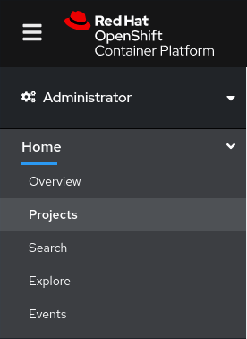
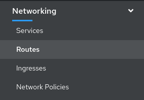
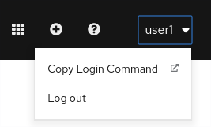
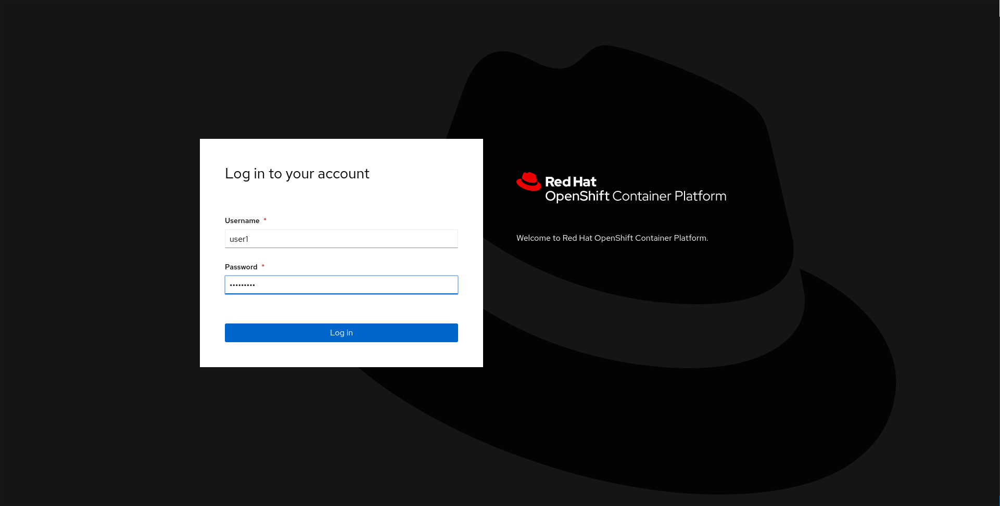
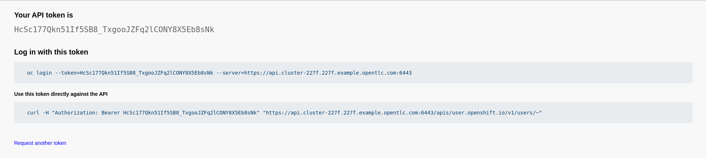

:user-password: openshift

= OpenShift Foundation

// This is a template meant to be used as a starting point for walkthrough development

[type=walkthroughResource,serviceName=openshift]
.Red Hat OpenShift
****
* link:{openshift-host}/console[Console, window="_blank"]
* link:https://help.openshift.com/[Openshift Online Help Center, window="_blank"]
* link:https://blog.openshift.com/[Openshift Blog, window="_blank"]
****

[type=walkthroughResource,serviceName=openshift]
.Credenciales OpenShift
****
* **User:** `{user-username}`
* **Password:** `{user-password}` 
****

[time=5]
[id='openshift-foundation']
== Lab 0: Setup
En esta guía, `*{user-username}*` es el usuario que se le fue asignado al iniciar el workshop, con este usuario deberá ingresar a la link:{openshift-host}[consola de OpenShift, window="_blank"] y seguir los siguientes pasos:

. Click en el menu `*Home > Projects*`
+

. Click en el proyecto `*occli*`
. Click en el menu `*Networking > Routes*`
+

. Click en la ruta `*occli*`
. En la esquina superior derecha dar click en su usuario y luego click en `*Copy Login Command*`
+

. Ingresar sus credenciales
+

. Click en `*Display Token*` y copiar el comando oc que se muestra.
+

. Pegar comando en la terminal y presionar enter.
+
image::images/lab00-06.png[user-terminal, role="integr8ly-img-responsive"]

NOTE: Debes aceptar la conexion insegura que te presenta el comando OC.

[type=verification]
====
Pudiste conectarte al CLI de OpenShift?
====

[type=verificationFail]
Verifica que tengas instalado el cliente OC. Sigues con problemas? Contacta a uno de los administradores!

[time=5]
== Task Title

// Subtasks are not required. 
// For simple walkthroughs, create your procedure under tasks.

=== Subtask Title

. Do first step.
. Do second step.

[type=verification]
====
Did it work?
====

[type=verificationFail]
Try the steps again. If it's still not working contact your administrator.